<picture>
  <source media="(prefers-color-scheme: dark)" srcset="https://readme-typing-svg.demolab.com?font=JetBrains+Mono&weight=600&size=20&duration=2800&pause=900&color=67E8F9&center=true&vCenter=true&width=900&lines=%E2%9D%AF+Software+Engineer+%26+Technical+Leader;%E2%9D%AF+.NET+%C2%B7+Angular+%C2%B7+Azure+%C2%B7+Kubernetes;%E2%9D%AF+CI%2FCD+%C2%B7+DevOps+%C2%B7+Cloud;%E2%9D%AF+Spec-Driven+Development+%2B+AI+coding+agents;%E2%9D%AF+Mentoring+teams+of+8%2B+developers">
  
</picture>

---

## `❯ stats --daily`

  
  

## `❯ inventory`

  

## `❯ quest --featured`

  
  

## `❯ dungeon --log`

  

📄 Thesis loot: <a href="http://hdl.handle.net/11522/1947">M.S. · music-learning video game</a> · <a href="https://hdl.handle.net/10819/18601">B.S. · electro-stimulation system</a>

## `❯ contributions`

<picture>
  <source media="(prefers-color-scheme: dark)" srcset="https://raw.githubusercontent.com/cabu0124/cabu0124/output/snake-dark.svg">
  <source media="(prefers-color-scheme: light)" srcset="https://raw.githubusercontent.com/cabu0124/cabu0124/output/snake-light.svg">
  
</picture>
